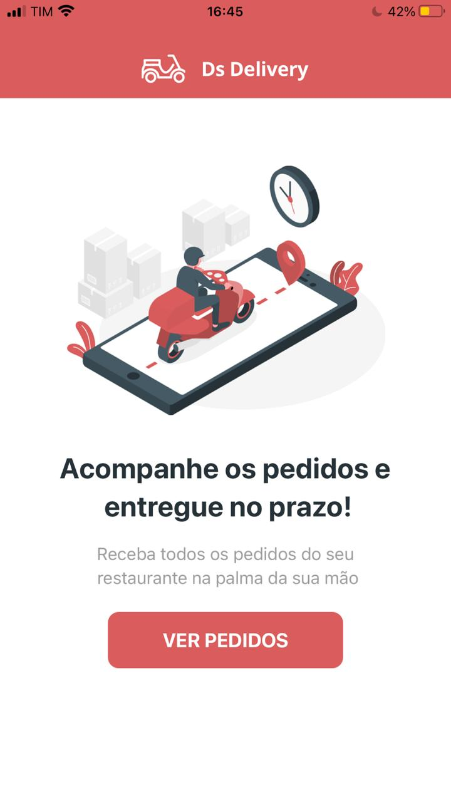
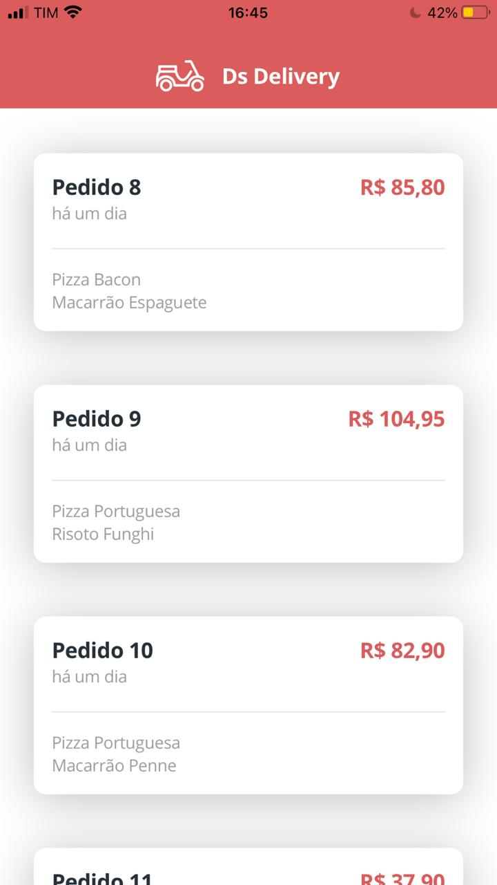
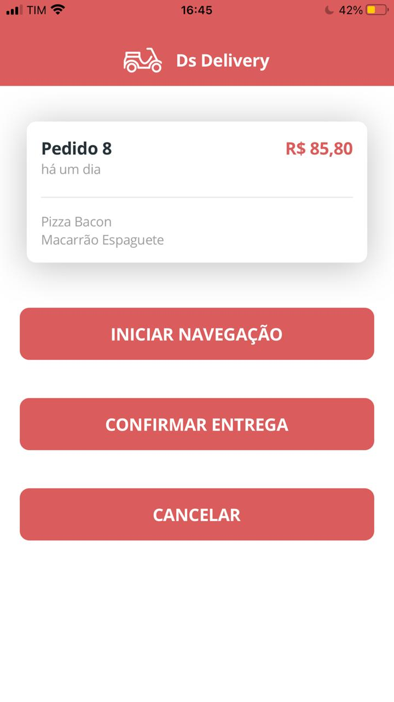

# 📱 Frontend Mobile Ds Delivery

O frontend mobile foi desenvolvido durante a 2ª semana do DevSuperior.

**Atenção**: 
- Para subir a aplicação localmente é necessário ter o `node` instalado na máquina.

- Para acessar o aplicativo, é necessário ter baixado no celular o aplicativo `Expo` e também o `Google maps`.

- É necessário que seu celular esteja conectado na mesma rede em que seu computador está executando a aplicação. 

- Execute o comando `npm i` para baixar as dependências.

Feitos os passos acima, execute `npm start`.

**Usuários iOS**:
- Abra a câmera do celular e escaneie o qr code que será gerado quando a aplicação inicializar.

**Usuários android**: 
- Abra o aplicativo `Expo` e escaneie o qr code. 

Agora você pode testar a aplicação normalmente.

## 📲Imagens do app

  

  

  

## 🛠️ Ferramentas
1. Typescript
2. React native
3. Expo
4. Dayjs
5. Axios

## 🗺️ Expo
Link para mais informações e download do aplicativel móvel `Expo`: 
https://expo.io/